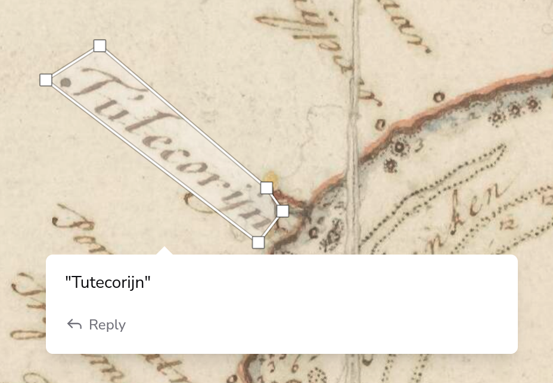
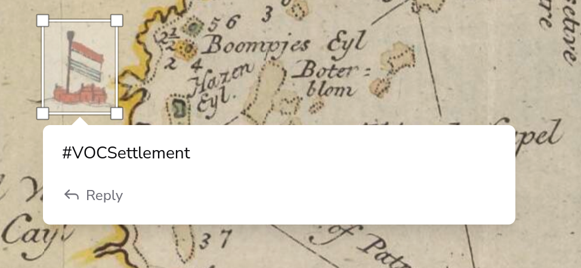
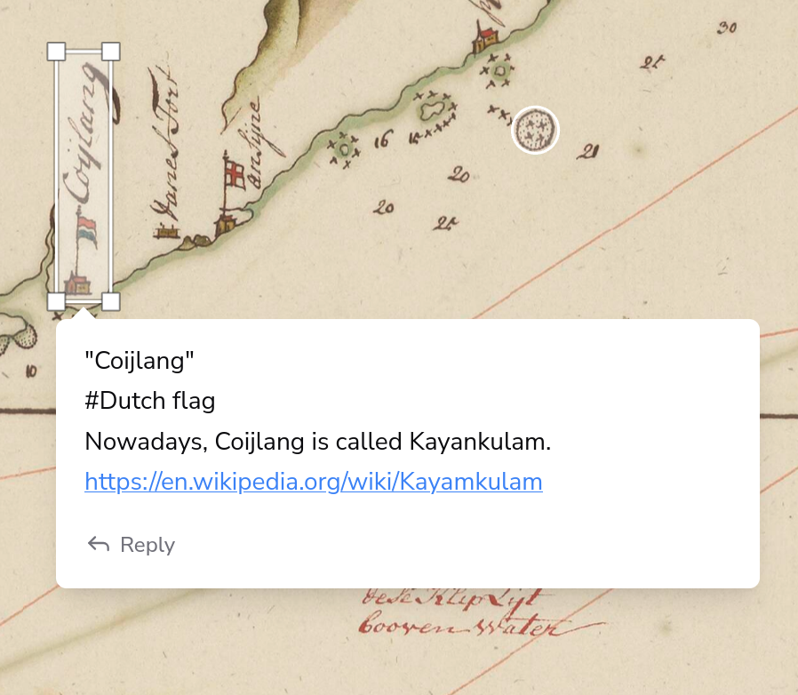

# Necessary Reunions Workshop 2025
*Warwick University, UK. March 4th, 2025*

This repository contains the data and annotations that were used and created during the interactive part of the workshop.

- [Necessary Reunions Workshop 2025](#necessary-reunions-workshop-2025)
  - [Summary](#summary)
  - [Data](#data)
    - [Links for viewing](#links-for-viewing)
    - [Links for annotating](#links-for-annotating)
  - [Collaborative Annotation](#collaborative-annotation)
    - [Examples](#examples)

## Summary

> ### Necessary Reunions: Remarrying Maps to Text and Reconceptualizing Histories of Early Modern Asia.
> Maps and textual sources in the Dutch East India Company (VOC) archives were meant to be together. Maps were vital for understanding textual information about places. Written sources, in turn, enriched knowledge from maps. Previously, information from these sources could not be reintegrated because no suitable techniques existed to reunify them. Today emerging techniques of georeferencing on maps and machine generated transcriptions on text and maps make this possible. The Necessary Reunions project applies these methods to the VOC archives on early modern Asia. This enables us to reconceptualize Asia's early modern topography and support writing new histories of the region.

More information on the project: https://www.huygens.knaw.nl/en/projecten/necessary-reunions/

## Data
We have selected 10 maps to be annotated and georeferenced, all coming from two map collections ([4.VEL](https://www.nationaalarchief.nl/onderzoeken/archief/4.VEL) and [4.VELH](https://www.nationaalarchief.nl/onderzoeken/archief/4.VELH)) that are held by the Dutch National Archives. The maps are of the Malabar region in India.

For an overview of these maps and their metadata, see the [`selection.csv`](selection.csv) file in this repo. This file is transformed into a [IIIF Manifest](https://iiif.io/api/presentation/3.0/) that can be used for viewing, georeferencing and further annotating the maps. 

The URI of this manifest is: [`https://globalise-huygens.github.io/2025-warwick-workshop/manifest.json`](https://globalise-huygens.github.io/2025-warwick-workshop/manifest.json). This can be used to view the map collection in various IIIF compatible tools, such as Mirador, Theseus Viewer, and Allmaps.

### Links for viewing
* View the manifest in [Mirador](https://projectmirador.org/embed/?iiif-content=https://globalise-huygens.github.io/2025-warwick-workshop/manifest.json) 
* View the manifet in [Theseus Viewer](https://theseusviewer.org/?iiif-content=https%3A%2F%2Fglobalise-huygens.github.io%2F2025-warwick-workshop%2Fmanifest.json)
* View the manifest in [Allmaps](https://viewer.allmaps.org/?manifest=https%253A%252F%252Fglobalise-huygens.github.io%252F2025-warwick-workshop%252Fmanifest.json)

### Links for annotating
* Georeference these maps in [Allmaps](https://editor.allmaps.org/images?url=https%3A%2F%2Fglobalise-huygens.github.io%2F2025-warwick-workshop%2Fmanifest.json)
* Annotate these maps in [Liiive](https://liiive.now/9dw4gba4b9n2)

## Collaborative Annotation

We'll use the collaborative annotation environment [Liiive](https://liiive.now/) to annotate this collection of maps. When annotating, please use the following guidelines:

1. Annotate the maps with any information you find interesting or relevant. This can be anything from toponyms, to geographical features, to other iconography. Where possible, use the **polygon drawing tool** to mark the area of interest. 
2. You can add extra information on this area in a free text comment field. To give this information a bit more structure, put a **transcription** of the text between `"`quotes`"`. Similarly, if you want to tag an area of the map, prefix your tags with a `#`. 
3. Besides **transcribing** and **tagging**, you can also include **urls** to external sources that provide more information on the area that you are annotating. For instance, you could link to the Wikipedia/Wikidata page, or link to the GeoNames page of a place. The fact that these urls start with `http` will make them stand out from other annotations.
4. Any other remarks and comments can be added in the free text comment field like normal text.
5. Enter every **new comment** for the same area on a new line, or reply to an existing comment for each of the transcription, tags, and urls. This way, we can easily filter and search through the annotations later on.

### Examples
Here are some examples of how you could annotate a map:

**Transcription**

**Tag**

**Full example**

The goal of this workshop is to get a sense of the kind of information that can be extracted from these maps. We are not looking for a complete transcription or annotation of the maps. Feel free to annotate as much or as little as you like.